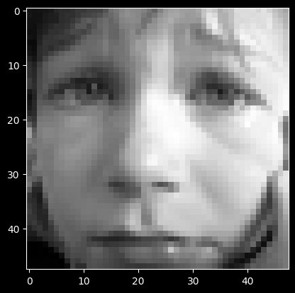
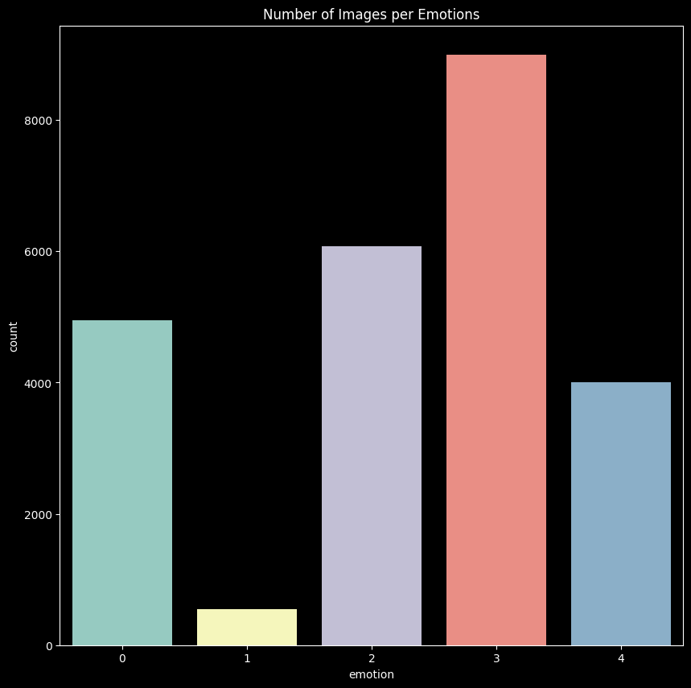
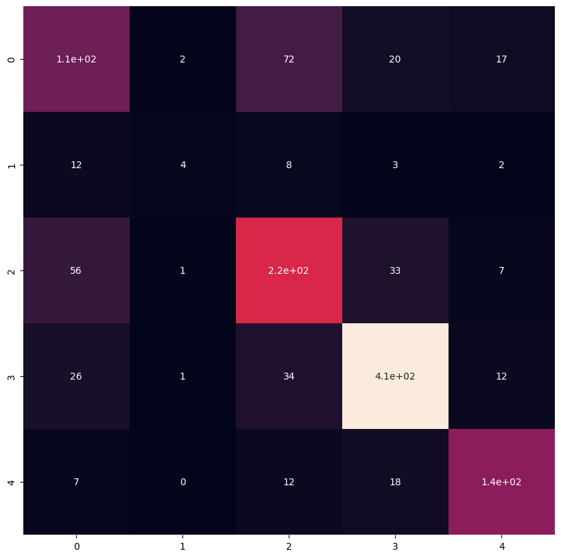
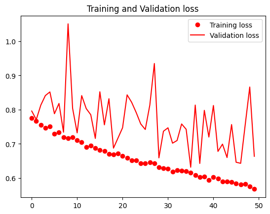

# Facial Expression Classification Using Residual Neural Nets


## Introduction

This project aims to create a deep learning model based on Convolutional Neural Networks (CNNs) and Residual Blocks to predict facial expressions or emotions. Facial expression classification is crucial for applications in emotional artificial intelligence, such as detecting customer responses to advertisements and driver monitoring systems.

- Model accuracy:  0.7853

## Project Structure

Facial Expression Classification Using Residual Neural Nets is divided into the following tasks:

- Project Overview/Understand the problem statement and business case
- Import Libraries/datasets and perform preliminary data processing
- Perform Image Visualization
- Perform Image Augmentation, normalization, and splitting
- Build and Train Residual Neural Network Model
- Assess the Performance of the Trained Model

## Import Libraries and Datasets

```python
# Import necessary libraries and datasets
import pandas as pd
import numpy as np
import matplotlib.pyplot as plt
import seaborn as sns
import cv2
import tensorflow as tf
from tensorflow.keras import layers
from tensorflow.keras.preprocessing.image import ImageDataGenerator
from tensorflow.keras.layers import *
from tensorflow.keras.models import Model, load_model
from tensorflow.keras.callbacks import ReduceLROnPlateau, EarlyStopping, ModelCheckpoint, LearningRateScheduler
from sklearn.model_selection import train_test_split
from sklearn.metrics import confusion_matrix, classification_report
```

## Perform Data Visualization

```python
# Perform data visualization
...
```


- Visualize the first image in the dataframe
  



- Plot barplot showing how many samples are present per emotion





## Perform Data Augmentation

```python
# Perform data augmentation
...
```

## Build and Train Deep Learning Model for Facial Expression Classification

```python
# Build and train the deep learning model
...
```

## Assess the Performance of Trained Facial Expression Classifier Model

```python
# Assess the performance of the trained model
...
```





- Training and Validation loss




```
              precision    recall  f1-score   support

           0       0.44      0.50      0.46       224
           1       0.00      0.00      0.00        29
           2       0.66      0.55      0.60       317
           3       0.78      0.86      0.82       479
           4       0.76      0.78      0.77       180

    accuracy                           0.68      1229
   macro avg       0.53      0.54      0.53      1229
weighted avg       0.67      0.68      0.67      1229

accuracy:  0.7853 - loss: 0.5675 - val_loss: 0.6636 - val_accuracy: 0.7533
```


This project showcases the development of a facial expression classification model using CNNs and Residual Neural Networks. It covers various stages, including data preprocessing, model building, training, and evaluation. The trained model demonstrates promising performance in accurately predicting facial expressions, contributing to the field of emotional artificial intelligence.

```
